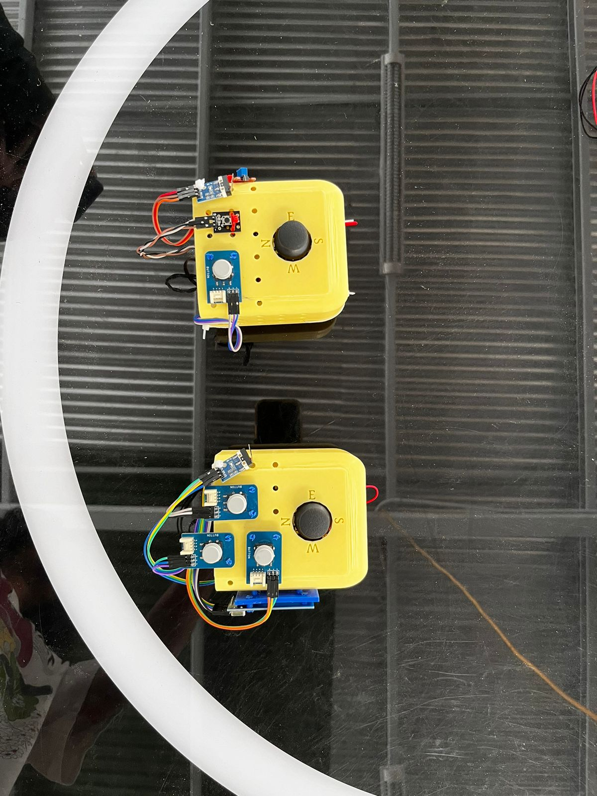
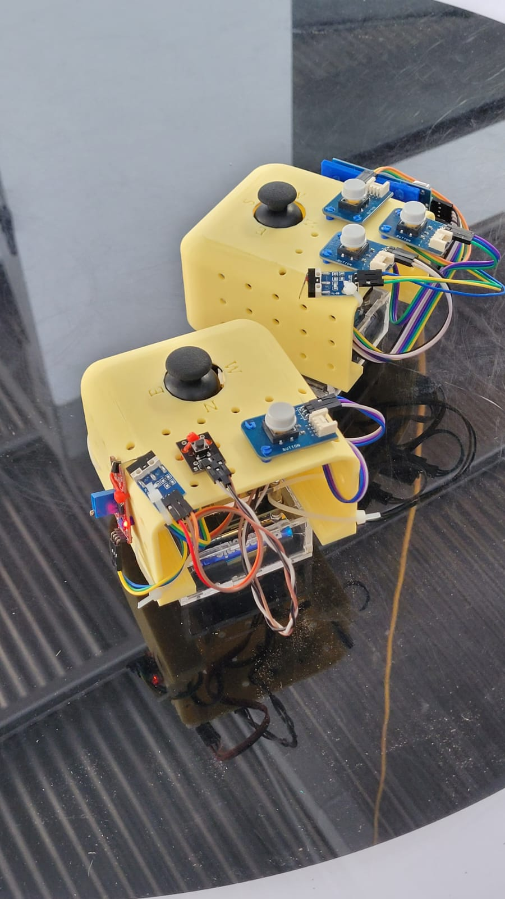

# EasyPlay-ExpoCENFO
El proyecto EasyPlay es un control de videojuegos, compatible con computadoras, enfocado en la accesibilidad y modularidad en su diseño y uso.

El proyecto usa de 2 IdeaBoards de CrCibernetica, la cual usa un ESP32-WROOM-32E de Espressif

Inicial

Terminado

